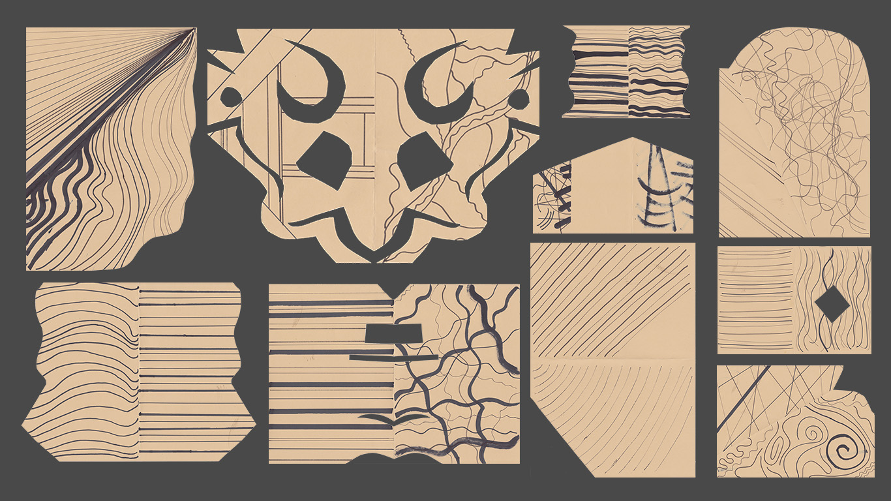
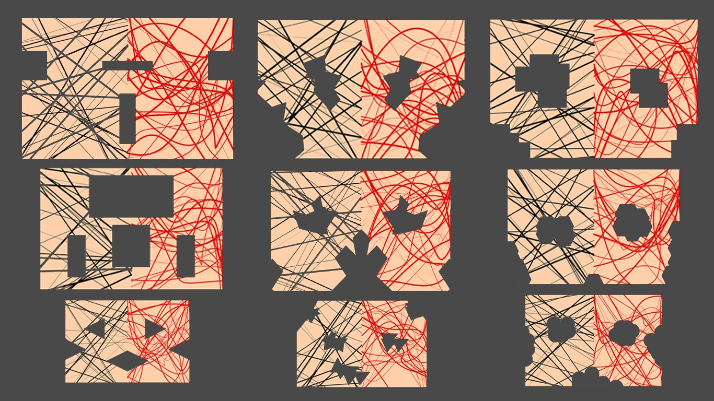

README: Englisch
#MASKEN

### Abstract:
The projekt "Mask"(masks) creates masks with help of an algorithm. Therefore we wrote algorithm in writing form and accomplished on paper it with the help of Humans. After different tries we convert the algorithm in digital (Python) and were looking for an application oriented use of it. In my case it becomes masks.

**1.	Step algorithm in writing form:**

1. 	first algorithm instrucion will follow soon!!!
	

**2.	updated version of the first algorithm**
	
1.	
Draw on a white rectangle paper 100g thick with a black pen.  
2.	Draw a straight wavy line from the left hand side to the right hand side of the paper. The position of the line is on your decision.  
3.	On the left hand side of the paper of the line (Paper Edge) let the line reflect in 30 - 90 degree and continuing the straight wavy line to the next paper edge.
4.	repeat step 1. - 3. 20 times  
5.	Now turn the paper about 90 degree and repeat step 1. - 4.  
6.	Take a red pen and repeat step 1. - 5. and paint only 3 repetition instead of 20.  

**2. New version of the written algorithm:**

1.	fold the paper one time.  
2.	take black pants with different thickness. Draw 20 straight lines on the paper.  
3.	turn the paper on the backside.
4.	draw 20 wavyy lines on the paper.
5.	 cut one side of the paper to create an interesting paper form.
6.	unfold the paper.  

**3. Try to digitize the algorithm**

1.	lines scatter on the are (Processing)

2.	designated parts of the area get cut by chance and the position in the designated area was also randomly(done only with Photoshop up to now)

### Prerequisite:
masks
-	You need Processing(software) to repead all steps
-	a paper and some pens

### Dependencies:
- to use Processing you have to install Processing see link [Processing](https://processing.org/). On the page you find also some instruction how to deal with it.

### Usage
- After opening Processing and copy the [Code](code.pyde) in the empty Processing window. Save the document and start it with the play button.
- If everything is working and you see a new window with different lines, you are able to change some parts of the code and find some new creations of line scatter. Therefore read the comment lines in the code.

### Something else:
Unfortunately the code is not totally finish, that's the reason way you can only play with the lines. The black geometric areas are not included in the code up to now.

### Realted Works:

### Thanks:
Thanks to all my friends who took time to implement my algorithm and all my classmates of the Eingabe Ausgabe course summer semester 2015. Especially Fabiantheblind our docent.

### Contact:
In case you have some question or something is not understandable, simply contact me Johannes.Leick@gmx.de have fun.

##Public License
Copyright (C) 2015 Johannes Leick aka JohannesProximo Everyone is permitted to copy and distribute verbatim or modified copies of this license document, and changing it is allowed as long as the name is changed.