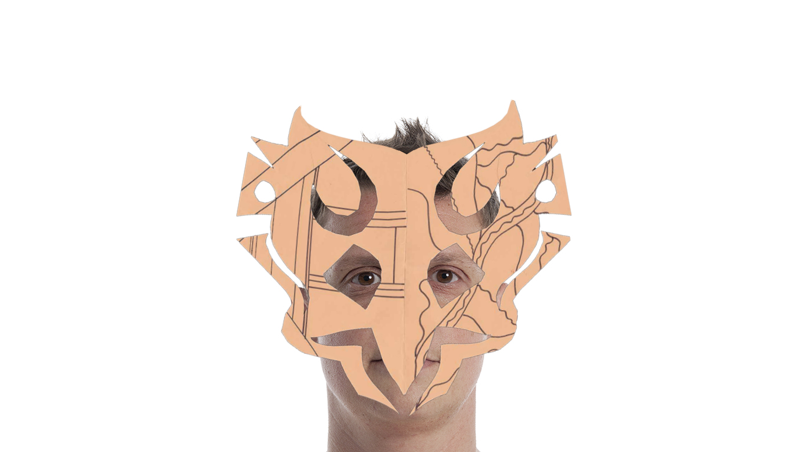
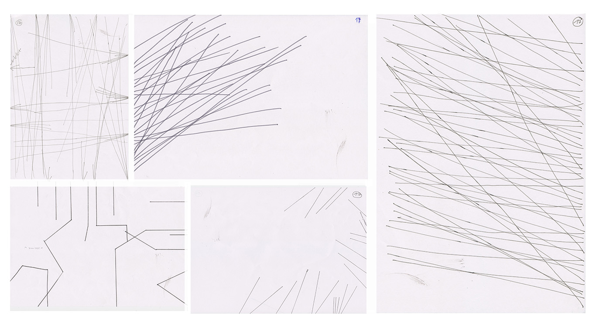
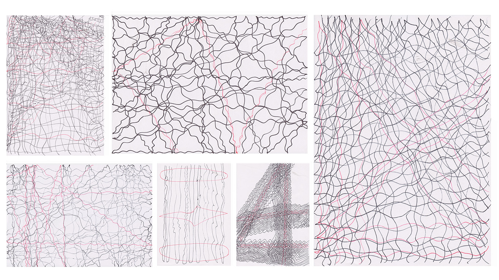
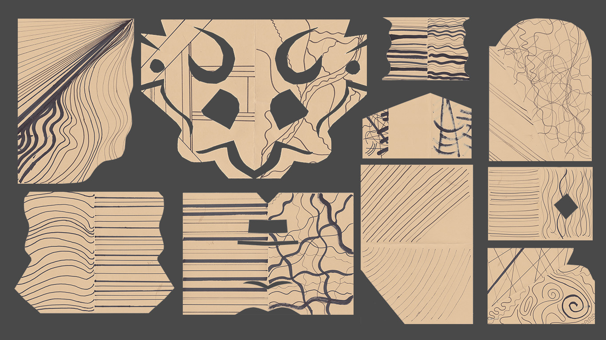
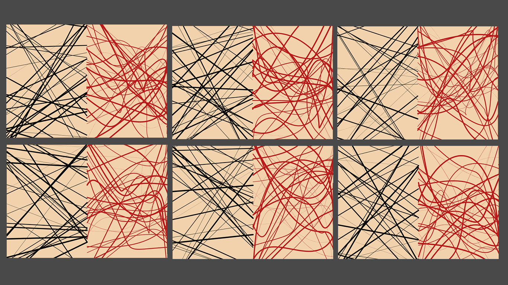
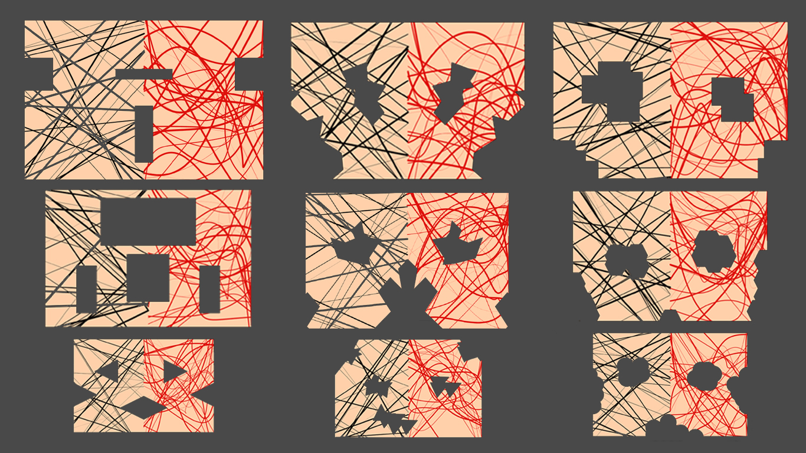

README: German/[English](README-English)
#MASKEN

###Allgemein:
Im Projekt „Masken“ geht es darum Masken mit Hilfe eines Algorithmus es zu erstellen. Dabei wurde zuerst Algorithmen in schriftlicher Form aufgeschrieben und diesen dann von Personen ausgeführt. Nach mehreren Versuchen wurde dieser Algorithmus in einen Digitalen Code übertragen und dabei ein Anwendungsbeispiel gefunden. In meinem Fall wurden es Masken.

**1.	Schritt der Schriftliche Algorithmus:**

1. 	Anweisungen kommen noch!!!
	

**2.	Überarbeitete version des Schriftlichen Algorithmus**
	
1.	Zeichne auf ein weißes rechteckiges Papier der dicke 100 g mit einem schwarzen Folienstift der stärke F.  
2.	Ziehe eine gerade wellige Linie von der linken seitenkante zur rechten seitenkante. Die Position der gerade ist dir überlasen.  
3.	An dem rechtem Ende der Linie(Seitenkante) lasse die Linie in ca. 30 – 90 Grad reflektieren und ziehe erneut eine wellige gerade bis zur nächsten Seiten kannte.
4.	Wiederhole Schritt 1.-3. 20 mal  
5.	Nun drehe das Blatt um 90 Grad und wiederhole Schritt 1-4  
6.	Nehme nun einen roten Fine Liner und wiederhole Schritt 1-5 und zeichen anstatt 20 Strichwiederholungen nur 3 Wiederholungen.  

**2. Neue version des Schriftlichen Algorithmus:**

1.	Falte das Blatt einmal.  
2.	Nehme Schwarze Filzstifte unterschiedlicher Stärke. Ziehe 20 >gerade Linien über das Blatt.  
3.	Drehe das Blatt um.
4.	Ziehe nun 20 geschwungene Linien über das Blatt.
5.	 beschneide eine Seite des Blattes um ein für dich spannendes Format zu erstellen.
6.	Falte das Blatt wieder auf.  

**3. Versuch den Algorithmus ins Digitale zu übertragen**

1.	Linien zufällig auf der Fläche verteilen (Processing)

2.	Bestimmte Teile der Fläche in zufälliger Anzahl und position ausschneiden (Bis jetzt nur mit Photoshop)

###Benötigt:
MASKEN
-	Wird das Programm Processing benötigt
Falls du alle Schritte wiederholen möchtest
-	ein Blatt Papier und Stift

###Installation:
- Um Processing zu verwenden musst du es über den Folgenden Link [Processing](https://processing.org/) installieren. Auf dieser Seite findest du auch alle Hilfsmittel die due benötigst um damit zu arbeiten.

###Anwenden/Benutzen
- Danach öffne Processing und kopiere den [Code](code.pyde) in das Leere Processing Fenster. Das fenster sollte (sketch_150922) oder änhlich heisen. Speichere das Dokument und starte das Programm über den Play Button.
- Funktioniert alles soweit ? Dann kannst du mit dem Code herumspielen und versuchen ihn zu verändern. Dafür lese die Kommentare im Code.

###Anmerkungen:
Leider ist der Code noch nicht ganz fertig daher werden Linien nur in zufälliger folge Dargestellt.
Die Schwarzen flächen sind bis jetzt noch nicht im code integriert.

###Verwandte Arbeiten:

###Dank:
Dank geht an alle meine Freunde die sich Zeit genommen haben meine Algorithmen auszuführen und all meinen Kommilitonen des Eingabe Ausgabe Kurses des Sommersemester 2015. Gans besonders natürlich Fabiantheblind unseren JEDI Meister.

###Kontakt:
Falls ihr Fragen habt oder irgendetwas unklar ist könnt ihr mich gerne kontaktieren unter Johannes.Leick@gmx.de
Viel Spaß

##Public License
Copyright (C) 2015 Johannes Leick aka JohannesProximo Everyone is permitted to copy and distribute verbatim or modified copies of this license document, and changing it is allowed as long as the name is changed.
